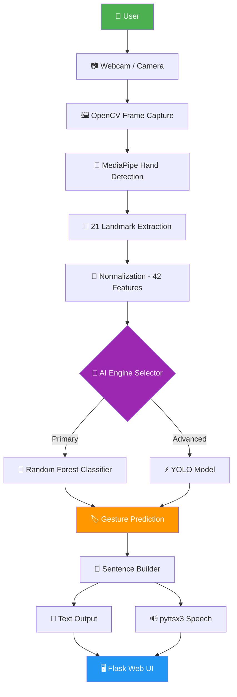

<div align="center">

<h1>🤟 SilentEcho</h1>

<p align="center">
  <b>AI-Powered Real-Time Sign Language Recognition & Speech Converter</b><br/>
  <i>Bridging the communication gap — one gesture at a time.</i>
</p>

<p align="center">
  
  
  
  
  
</p>

<p align="center">
 
  
  
  
  
</p>

<br/>

> **SilentEcho** is an AI/ML-powered assistive communication system that translates real-time sign language gestures into text and speech — using just a webcam. Built with MediaPipe, Random Forest, and YOLO, it bridges the gap between the hearing-impaired community and the general public.

</div>

---

## 📑 Table of Contents

- [📍 Problem Statement](#-problem-statement)
- [📖 About the Project](#-about-the-project)
- [✨ Key Features](#-key-features)
- [🏗️ System Architecture](#️-system-architecture)
- [🛠️ Software Requirements](#️-software-requirements)
- [🚀 Technology Stack](#-technology-stack)
- [📂 Dataset](#-dataset)
- [📊 Results & Accuracy](#-results--accuracy)
- [🔮 Future Scope](#-future-scope)
- [🏁 Getting Started](#-getting-started)

---

## 📍 Problem Statement

> *"Over 70 million deaf people worldwide use sign language as their primary mode of communication — yet most of the world cannot understand them."*

Communication between hearing-impaired individuals and the general public remains a persistent challenge. Existing solutions are:

- 💸 **Expensive** — specialized hardware puts them out of reach for most users
- 🐌 **Not real-time** — too slow for natural conversation
- 🔒 **Inaccessible** — require installation, setup, or trained operators

**SilentEcho** solves this with a low-cost, real-time, webcam-only AI system that requires no special hardware — just a laptop and a camera.

---

## 📖 About the Project

**SilentEcho** is a full-stack AI/ML assistive system that enables users to translate hand gestures into meaningful text and spoken words in real-time.

The system is built on three core pillars:

| Pillar | Technology | Purpose |
|--------|------------|---------|
| 👁️ **Perception** | OpenCV + MediaPipe | Capture and detect hand landmarks in real-time |
| 🧠 **Intelligence** | Random Forest + YOLO | Classify gestures with high speed and accuracy |
| 🔊 **Expression** | pyttsx3 TTS Engine | Convert predictions to natural spoken audio |

Whether it's a single-hand ASL letter or a two-handed ISL gesture, SilentEcho understands and speaks it.

---

## ✨ Key Features

### ✋ Real-Time Gesture Recognition
- Detects **21 hand landmarks** per hand using MediaPipe
- Supports both **single-hand (ASL)** and **two-hand (ISL)** gestures
- Processes video stream with **< 50ms latency** for a truly real-time experience

### 🧠 Machine Learning at the Core
- Powered by a **Random Forest Classifier** — lightweight, fast, and interpretable
- Trained on a **custom webcam dataset** built in-house
- Features engineered from **42 normalized (x, y) landmark coordinates**

### 🔊 Text-to-Speech Output
- Converts recognized gesture predictions directly into spoken audio
- Uses **pyttsx3** — a fully offline TTS engine (no internet required)
- Works seamlessly across Windows, macOS, and Linux

### 🧩 Smart Sentence Builder
- Combine individual gesture predictions into **complete words and sentences**
- Supports real-time editing, deletion, and sentence clearing
- Designed for fluid, natural conversation flow

### 🔐 User Authentication System
- Secure **user registration and login** system
- Lightweight **SQLite backend** — no external database setup required
- Session-based access control for personalized usage

### 🤖 Hybrid AI Pipeline (MediaPipe + YOLO)
- **MediaPipe** handles fast landmark-based detection (primary mode)
- **YOLO** steps in for advanced gesture image classification
- Intelligent **auto mode-switching** between the two engines based on confidence scores

---

## 🏗️ System Architecture

SilentEcho follows a modular, computer-vision-driven pipeline — from raw webcam frames to spoken output.



### Pipeline Breakdown

| Stage | Component | Description |
|-------|-----------|-------------|
| **Input** | Webcam | Captures live video at 30 FPS |
| **Detection** | MediaPipe | Extracts 21 (x, y) landmarks per hand |
| **Preprocessing** | Normalization | Converts to 42-feature vector, scale-invariant |
| **Classification** | Random Forest / YOLO | Predicts gesture label from feature vector |
| **Output** | Flask UI + pyttsx3 | Displays text and plays audio simultaneously |

---

## 🛠️ Software Requirements

<details>
<summary><b>🔹 Frontend</b></summary>

- HTML5
- CSS3
- Vanilla JavaScript
- Jinja2 (Flask Templates)

</details>

<details>
<summary><b>🔹 Backend</b></summary>

- Python 3.8+
- Flask (Web Server)

</details>

<details>
<summary><b>🔹 Core Libraries</b></summary>

| Library | Version | Purpose |
|---------|---------|---------|
| `opencv-python` | ≥ 4.7 | Video capture & image processing |
| `mediapipe` | ≥ 0.10 | Hand landmark detection |
| `scikit-learn` | ≥ 1.2 | Random Forest model training & inference |
| `pyttsx3` | ≥ 2.90 | Offline text-to-speech |
| `ultralytics` | ≥ 8.0 | YOLO model integration |
| `flask` | ≥ 2.3 | Web application framework |
| `numpy` | ≥ 1.24 | Numerical computations |

</details>

<details>
<summary><b>🔹 Database</b></summary>

- SQLite3 (built into Python — no separate installation needed)

</details>

---

## 🚀 Technology Stack

<table>
  <tr>
    <td align="center" width="150">
      <b>👁️ Vision</b><br/>
      OpenCV<br/>MediaPipe
    </td>
    <td align="center" width="150">
      <b>🧠 ML / AI</b><br/>
      Random Forest<br/>YOLO (Ultralytics)
    </td>
    <td align="center" width="150">
      <b>🌐 Backend</b><br/>
      Python<br/>Flask
    </td>
    <td align="center" width="150">
      <b>🎤 Speech</b><br/>
      pyttsx3<br/>Offline TTS
    </td>
    <td align="center" width="150">
      <b>💾 Database</b><br/>
      SQLite3<br/>Auth System
    </td>
    <td align="center" width="150">
      <b>💻 Frontend</b><br/>
      HTML / CSS<br/>JavaScript
    </td>
  </tr>
</table>

---

## 📂 Dataset

### 🔗 Dataset Access

[](https://drive.google.com/drive/folders/1p5wb8zP2BgJGclSVjybMAJz1KimUX9Zf)

### 📊 Dataset Overview

| Property | Details |
|----------|---------|
| **Source** | Custom-built using webcam recordings |
| **Format** | CSV (structured tabular data) |
| **Features per sample** | 42 (21 landmarks × x, y coordinates) |
| **Gesture types** | ASL alphabets, ISL common signs |
| **Collection method** | Real-time MediaPipe extraction → CSV logging |

### 🧮 Feature Engineering

Each data sample is a flattened vector of the 21 hand landmark coordinates detected by MediaPipe:

```
[x0, y0, x1, y1, x2, y2, ..., x20, y20]
        └──────── 42 features ────────┘
```

Landmarks are **normalized** relative to the wrist (landmark 0), making the model:
- ✅ Scale-invariant (works for different hand sizes)
- ✅ Position-invariant (works regardless of hand placement on screen)

### 🔀 Train/Test Split

```
Total Dataset
├── 80% → Training Set   (Random Forest fitting)
└── 20% → Test Set       (Accuracy evaluation)
```


## 📊 Results & Accuracy

### 🎯 Model Performance

| Metric | ASL (American Sign Language) | ISL (Indian Sign Language) |
|--------|------------------------------|----------------------------|
| **Accuracy** | 94% – 96% | 92% – 95% |
| **Inference Latency** | < 50 ms | < 50 ms |
| **Mode** | Real-time (30 FPS) | Real-time (30 FPS) |

### 📈 Key Observations

- ✅ Random Forest outperformed SVM and KNN baselines in gesture classification speed
- ✅ MediaPipe landmark normalization significantly improved accuracy across different lighting conditions
- ✅ Hybrid AI switching between MediaPipe and YOLO improved robustness for complex two-hand gestures
- ✅ System operates fully offline — no cloud dependency for inference

> 📌 *Results are based on experimental evaluation on the custom dataset under controlled and semi-controlled lighting conditions.*

---

## 🔮 Future Scope

| Enhancement | Description |
|-------------|-------------|
| 🧠 **Deep Learning** | Replace Random Forest with CNN or LSTM for higher accuracy on continuous gesture streams |
| 📱 **Mobile App** | Port the system to Android/iOS using TensorFlow Lite or ONNX |
| 🌍 **Multi-language Support** | Extend to BSL, French Sign Language, and other regional variants |
| ☁️ **Cloud Deployment** | Deploy on AWS/GCP/Azure for accessibility from any device |
| 🎥 **Continuous Recognition** | Move from static gesture snapshots to continuous, dynamic gesture sequences |
| 🤝 **Bidirectional Communication** | Add speech-to-sign avatar for full two-way communication |

---

## 🏁 Getting Started

### ✅ Prerequisites

- Python **3.8 or higher**
- A functioning **webcam** (built-in or external)
- Git installed

### 📦 Installation & Run

```bash
# 1. Clone the repository
git clone https://github.com/sanskar0911/Silentecho-.git
cd SilentEcho

# 2. (Optional but recommended) Create a virtual environment
python -m venv venv
source venv/bin/activate        # On Windows: venv\Scripts\activate

# 3. Install all dependencies
pip install opencv-python mediapipe scikit-learn flask pyttsx3 ultralytics numpy

# 4. Launch the application
python app.py
```

### 🖥️ Open in Browser

```
http://127.0.0.1:5000
```

> 💡 **Tip:** Make sure your webcam is connected and not in use by another application before running.

### 📁 Project Structure

```
Silentecho/
│
├── app.py                          # 🚀 Main Flask server — routes, webcam stream,
│                                   #    auth endpoints, YOLO + MediaPipe pipeline
│
├── gesture_recognition.py          # 🧠 Core ML module — trains Random Forest on CSV,
│                                   #    normalizes 42 landmarks, predicts gesture label
│
├── gesture_data_collector.py       # 📷 ASL dataset builder — captures webcam frames,
│                                   #    extracts MediaPipe landmarks → gesture_data.csv
│                                   #    (5000 samples/label)
│
├── isl_gesture_data_collector.py   # 🤚 ISL dataset builder — same pipeline tuned for
│                                   #    two-hand Indian Sign Language gestures
│                                   #    (500 samples/label)
│
├── best.pt                         # ⚡ YOLO model weights (trained, ~3.1 MB)
│                                   #    used for advanced gesture image classification
│
├── isl_gesture_data.csv            # 📊 ISL landmark dataset (~21 MB)
│                                   #    Format: label, x0–x20, y0–y20 (42 features)
│
├── pretrained_word.csv             # 📊 ASL/pretrained word dataset (~3.6 MB)
│                                   #    Used for Random Forest training
│
├── index.html                      # 🖥️ Full frontend UI — webcam feed, sentence builder,
│                                   #    login/register, TTS controls (~48 KB)
│
├── users.db                        # 🔐 SQLite database — stores hashed user credentials
│                                   #    (email + bcrypt password hash)
│
└── README.md                       # 📄 Project documentation
```

---


<div align="center">


<sub>© 2026 SilentEcho Team — FCRIT Vashi. All rights reserved.</sub>

</div>
